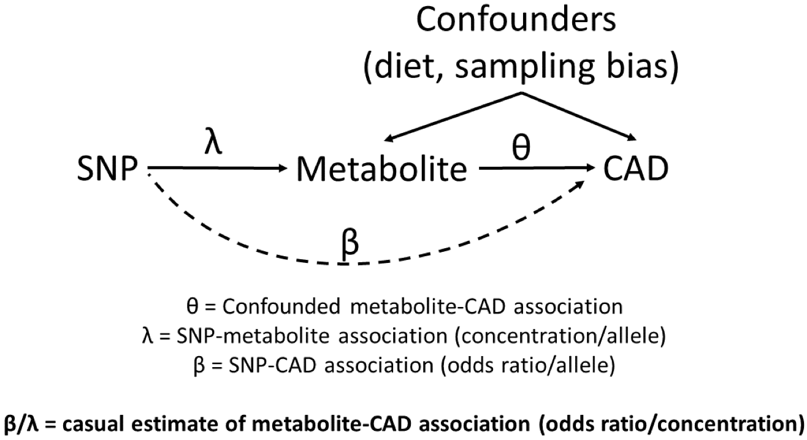
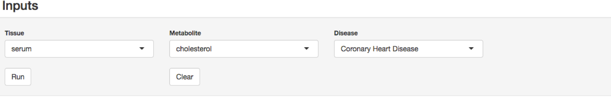
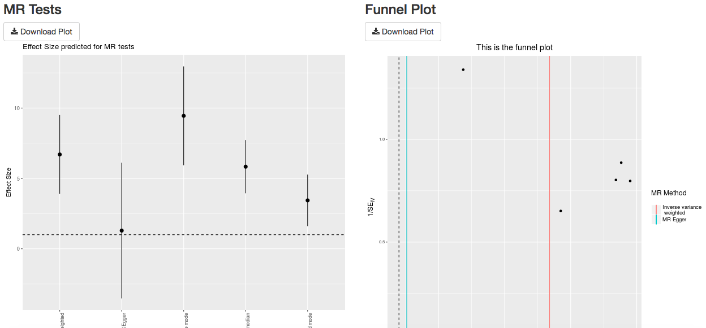
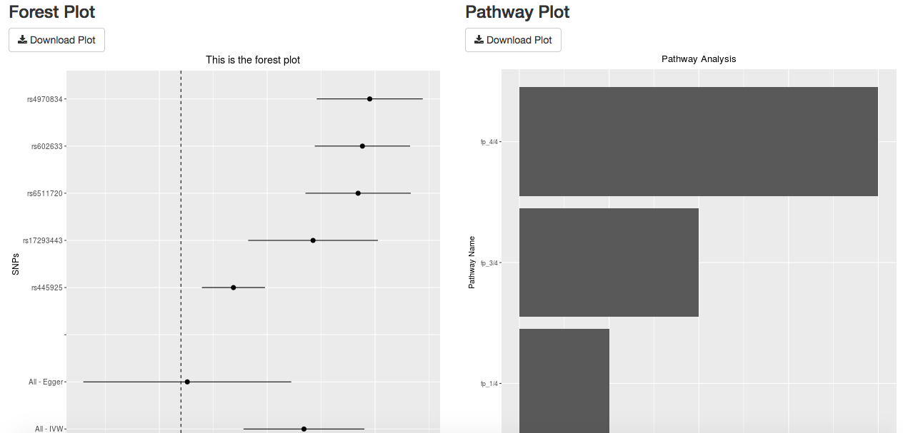
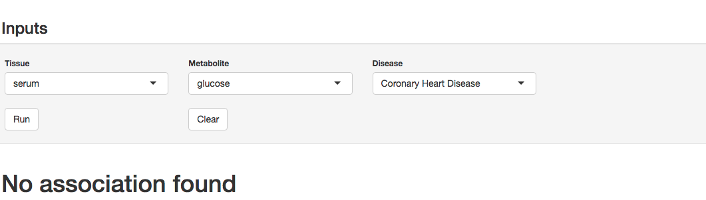

[<h1>_MR BACOn 🐷_</h1>](https://ncolaian.shinyapps.io/shinyapp/)

<h2>A Shiny application for Mendelian Randomization analysis of Biomarker Associations for Causality with Outcomes</h2>

<h2>Usage:</h2>

   [**R Shiny app User Manual**](https://github.com/NCBI-Hackathons/metaboliteassoc/blob/master/ShinyApp/README.md)
   
<h3>Back-end workflow</h3>

   [**Data acquisition and filtering**](https://github.com/NCBI-Hackathons/metaboliteassoc/blob/master/DataCleaningScripts/Data_cleaning_workflow.md)

   [**LD pruning**](https://github.com/NCBI-Hackathons/metaboliteassoc/blob/master/LDpruning/pruning.md)

   [**Mendelian Randomization**](https://github.com/NCBI-Hackathons/metaboliteassoc/blob/master/RuningMR/MR_Readme.md)

<h2>What is MR?</h2>

Mendelian Randomization (MR) is a means by which to test if there is evidence for a causal association between a biomarker of interest and an outcome. It is based on the random assortment of alleles that occurs during meiosis (hence the allusion to Gregor Mendel). It is sometimes referred to as "Nature's Randomized Controlled Trial" and also has roots in instrumental variable theory. The core idea is that alleles are passed down at random and may have effects on a given outcome through a specific biomarker. Since these the assignment of an allele (and it's resultant effect on a biomarker) is given to an individual by random chance - these effects are uncorrelated with sources of error and confounding that traditionally plague association tests. The instrumental variables used for Mendelian Randomization are most often single nucleotide polymorphisms (SNPs) and for BACOn our biomarkers are metabolites. The SNP-metabolite associations can be combined with SNP-CAD associations to give an estimate of the causal effect between the metabolite and CAD. Modern MR analyses use data from two independent samples, one of which estimates the SNP-biomarker(metabolite) association and the other estimates the SNP-outcome(CAD) associations in independent cohorts. A good reference for MR is <a href="http://onlinelibrary.wiley.com/doi/10.1002/gepi.21758/full">here</a> 

<h2>Shiny app User Interface</h2>

<h3>Example output</h3>

<h3>Another example</h3>

 
 
<h3>Team</h3>
Dr. Cavin Ward-Caviness, EPA 
Nur Shahir, UNC - Chapel Hill 
Nicholas Colaianni, UNC - Chapel Hill 
Jayashree Kumar, UNC - Chapel Hill 
Kevin Currin, UNC - Chapel Hill 
Yue Hao, NC State 

<h3>References</h3>

Burgess, S., Butterworth, A. and Thompson, S.G. 2013. Mendelian randomization analysis with multiple genetic variants using summarized data. Genetic Epidemiology 37(7), pp. 658–665. 
Hemani, G., Zheng, J., Wade, K.H., Laurin, C., Elsworth, B., Burgess, S., Bowden, J., Langdon, R., Tan, V., Yarmolinsky, J., Shihab, H.A., Timpson, N., Evans, D.M., Relton, C., Martin, R.M., Davey Smith, G., Gaunt, T.R., Haycock, P.C. and The MR-Base Collaboration 2016. MR-Base: a platform for systematic causal inference across the phenome using billions of genetic associations. BioRxiv. 
Kanehisa, M., Sato, Y., Kawashima, M., Furumichi, M. and Tanabe, M. 2016. KEGG as a reference resource for gene and protein annotation. Nucleic Acids Research 44(D1), pp. D457-62. 
Nikpay, M., Goel, A., Won, H.-H., Hall, L.M., Willenborg, C., Kanoni, S., Saleheen, D., Kyriakou, T., Nelson, C.P., Hopewell, J.C., Webb, T.R., Zeng, L., Dehghan, A., Alver, M., Armasu, S.M., Auro, K., Bjonnes, A., Chasman, D.I., Chen, S., Ford, I. and Farrall, M. 2015. A comprehensive 1,000 Genomes-based genome-wide association meta-analysis of coronary artery disease. Nature Genetics 47(10), pp. 1121–1130. 
Raffler, J., Friedrich, N., Arnold, M., Kacprowski, T., Rueedi, R., Altmaier, E., Bergmann, S., Budde, K., Gieger, C., Homuth, G., Pietzner, M., Römisch-Margl, W., Strauch, K., Völzke, H., Waldenberger, M., Wallaschofski, H., Nauck, M., Völker, U., Kastenmüller, G. and Suhre, K. 2015. Genome-Wide Association Study with Targeted and Non-targeted NMR Metabolomics Identifies 15 Novel Loci of Urinary Human Metabolic Individuality. PLoS Genetics 11(9), p. e1005487. 
Shin, S.-Y., Fauman, E.B., Petersen, A.-K., Krumsiek, J., Santos, R., Huang, J., Arnold, M., Erte, I., Forgetta, V., Yang, T.-P., Walter, K., Menni, C., Chen, L., Vasquez, L., Valdes, A.M., Hyde, C.L., Wang, V., Ziemek, D., Roberts, P., Xi, L. and Soranzo, N. 2014. An atlas of genetic influences on human blood metabolites. Nature Genetics 46(6), pp. 543–550. 

https://mrcieu.github.io/TwoSampleMR/ 
http://jcviolins.com/ 
https://emojipedia.org/pig-face/ 
https://www.shareicon.net/style/3d?p=385 
http://www.kraftrecipes.com/recipes/homemade-funnel-cakes-90128.aspx 
https://idatassist.com/avoid-inaccurate-conclusions-through-data-cleaning/ 
http://www.eurac.edu/en/research/health/biomed/services/Pages/LDExplorer.aspx 
https://pixers.com.tr/cikartmalar/agaclar-orman-alani-simge-vektor-cizim-tasarim-127084508 

