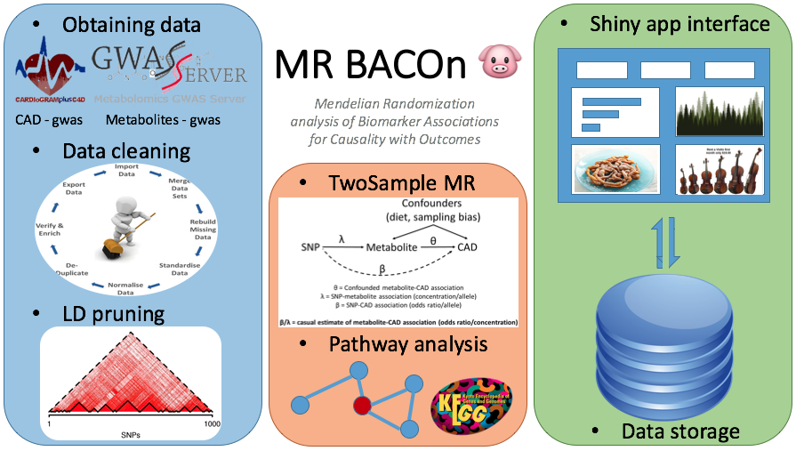

<b><h1>_MR BACOn 🐷_</h1></b>
<h2>A Shiny application for Mendelian Randomization analysis of Biomarker Associations for Causality with Outcomes</h2>

<h2>What is MR?</h2>
Mendelian Randomization (MR) is a means by which to test if there is evidence for a causal association between a biomarker of interest and an outcome. It is based on the random assortment of alleles that occurs during meiosis (hence the allusion to Gregor Mendel). It is sometimes referred to as "Nature's Randomized Controlled Trial" and also has roots in instrumental variable theory. The core idea is that alleles are passed down at random and may have effects on a given outcome through a specific biomarker. Since these the assignment of an allele (and it's resultant effect on a biomarker) is given to an individual by random chance - these effects are uncorrelated with sources of error and confounding that traditionally plague association tests. The instrumental variables used for Mendelian Randomization are most often single nucleotide polymorphisms (SNPs) and for BACOn our biomarkers are metabolites. The SNP-metabolite associations can be combined with SNP-CAD associations to give an estimate of the causal effect between the metabolite and CAD. Modern MR analyses use data from two independent samples, one of which estimates the SNP-biomarker(metabolite) association and the other estimates the SNP-outcome(CAD) associations in independent cohorts. A good reference for MR is <a href="http://onlinelibrary.wiley.com/doi/10.1002/gepi.21758/full">here</a>

https://mrcieu.github.io/TwoSampleMR/

<h2>Detailed descriptions of the pipeline</h2>
<h3>Back-end</h3>

   [**Data acquisition and filtering**](https://github.com/NCBI-Hackathons/metaboliteassoc/blob/master/DataCleaningScripts/Data_cleaning_workflow.md)

   [**LD pruning**](https://github.com/NCBI-Hackathons/metaboliteassoc/blob/master/LDpruning/pruning.md)

   [**Mendelian Randomization**](https://github.com/NCBI-Hackathons/metaboliteassoc/blob/master/RuningMR/MR_Readme.md)

<h3>Front-end</h3>

   [**R shiny application**](https://github.com/NCBI-Hackathons/metaboliteassoc/blob/master/ShinyApp/README.md)

